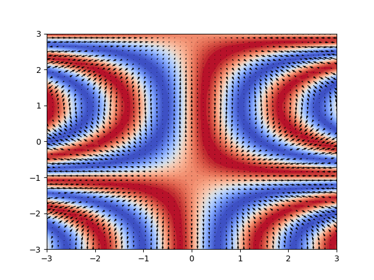

This is a leaf bundle.

LaTeX: $\frac{x+4}{\sin(x)^3}$

AsciiMath: ◊sum_(i=1)^n i^3=((n(n+1))/2)^2◊

```python
import numpy as np
import matplotlib.pyplot as plt

xx = np.linspace(-3, 3, 51)
X, Y = np.meshgrid(xx, xx)

f1 = 4
f2 = 0.8
p1 = 0.6
p2 = -0.77

Z = np.sin(f1*X * np.cos(f2*Y + p2) + p1)
gx, gy = np.gradient(Z)

plt.contourf(xx, xx, Z, 40, cmap='coolwarm')
plt.quiver(xx, xx, gx, gy)
plt.savefig('contour.png')
# plt.show()
```


